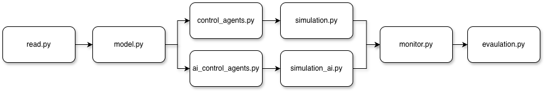
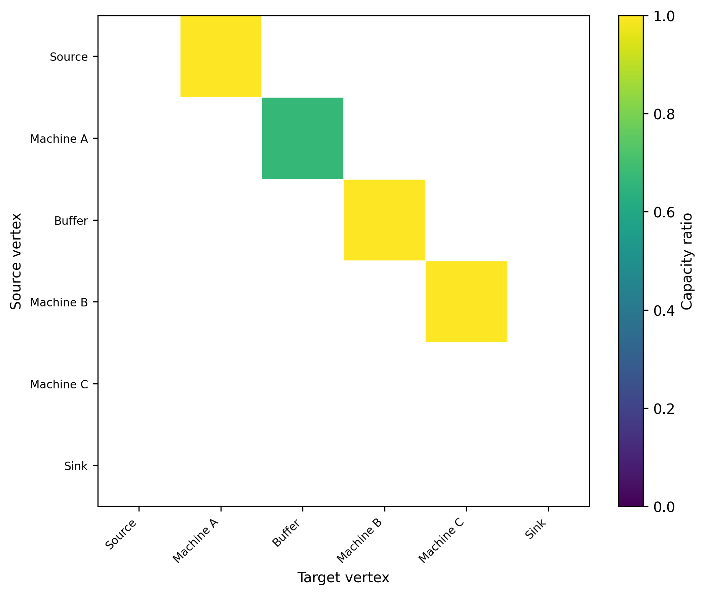
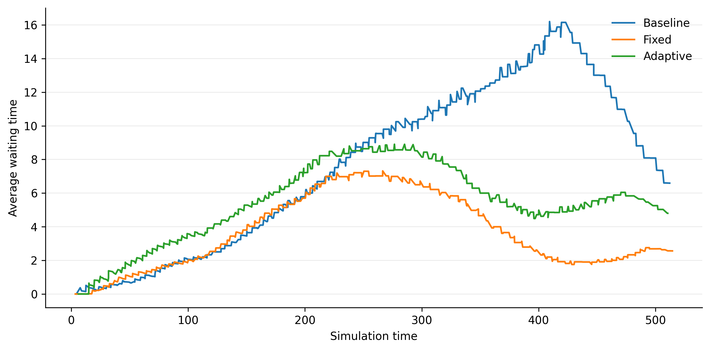

# Manufacturing System

This project models manufacturing systems as production flow networks. It uses **queueing-tool**, a Python library for agent-based network simulation, to represent and simulate product flow through manufacturing systems of varying sizes and complexities. The modeling approach is agnostic to system structure and can be applied to a wide range of manufacturing layouts.

## Pipeline

The project begins by preparing and structuring the input data in `production-line.xlsx`. The `read.py` module reads the input data, and `model.py` constructs the production flow as a queueing network and assigns the queue disciplines and arguments. The control agents implemented in `base_controller.py`, `control_agents.py`, and `ai_control_agents.py` adjust the arrival rates in response to bottlenecks and electricity prices. The queueing network is then simulated using `simulation.py` with different control strategies and without control. Simulation data are collected and summarized in `monitor.py`, and `evaluation.py` compares the results and exports them to `outputs.xlsx`. The figure below illustrates the project file structure and workflow roadmap.

## Tools and Libraries

- [Python](https://www.python.org/) - version: `3.10.11`
- [queueing-tool](https://github.com/djordon/queueing-tool) - version: `1.2.5`
- [pandas](https://pandas.pydata.org/) - version: `2.2.3`
- [NumPy](https://numpy.org/) - version: `2.3.5`

## Inputs and Outputs

- **`production-line.xlsx`**: Input data file containing the following Excel sheets:
  - **`Vertices`**: Contains the vertices of the production line and their attributes.
  - **`Edges`**: Contains the connections between vertices and their transition probabilities.
  - **`Controllers`**: Contains the controller rules, thresholds, and actions.

- **`outputs.xlsx`**: Output data file containg the following Excel sheets.
  - **`baseline_queue_data`**: Contains all the queue data for the baseline case.
  - **`fixed_queue_data`**: Contains all the queue data for the fixed control case.
  - **`adaptive_queue_data`**: Contains all the queue data for the adaptive control case.
  - **`baseline_monitoring_summary`**: Contains the monitoring summary for the baseline case.
  - **`fixed_monitoring_summary`**: Contains the monitoring summary for the fixed control case.
  - **`adaptive_monitoring_summary`**: Contains the monitoring summary for the adaptive control case.
  - **`baseline_machine_summary`**: Contains the machines summary for the baseline case.
  - **`fixed_machine_summary`**: Contains the machines summary for the fixed control case.
  - **`adaptive_machine_summary`**: Contains the machines summary for the adaptive control case.
  - **`baseline_buffer_summary`**: Contains the buffer summary for the baseline case.
  - **`fixed_buffer_summary`**: Contains the buffer summary for the fixed control case.
  - **`adaptive_buffer_summary`**: Contains the buffer summary for the adaptive control case.
  - **`baseline_bottleneck`**: Contains the bottleneck summary for the baseline case.
  - **`fixed_bottleneck`**: Contains the bottleneck summary for the fixed control case.
  - **`adaptive_bottleneck`**: Contains the bottleneck summary for the adaptive control case.
  - **`baseline_controller_state`**: Contains the controller states for the baseline case.
  - **`fixed_controller_state`**: Contains the controller states for the fixed control case.
  - **`adaptive_controller_state`**: Contains the controller states for the adaptive control case.

## Code Overview

- **`read.py`**: Reads data from the `production-line.xlsx` file and stores it in dictionaries.
- **`model.py`**: Constructs the queueing network model from the input data and assigns queue disciplines, arguments, and transition probabilities.
- **`base_controller.py`**: Defines the shared logic used by the control agents to read controller rules, observe system states, and adjust the source arrival process.
- **`control_agents.py`**: Defines control agents that check buffer and electricity thresholds during the simulation and adjust the source arrival rate according to the policies defined in `production-line.xlsx`.
- **`ai_control_agents.py`**: Defines adaptive control agents that check buffer thresholds during the simulation, adjust the threshold bottleneck threshold, and then decide whether to adjust the source arrival rate.
- **`simulation.py`**: Runs the baseline, fixed control, and adaptive control simulation cases and stores the outputs of all cases.
- **`monitor.py`**: Collects simulation data from the queueing network as well as monitoring summary, machines summary, buffer summary, bottleneck, and controller states.
- **`evaluation.py`**: Runs all simulation cases and exports the outputs to `outputs.xlsx`.

## Assumptions and Simplifications

- That there is only one policy defined per control agent in the input file.
- That the service times are fixed numbers. Alternatively, I would use data and the Fitter Python package to assign a suitable distribution function to each machine or buffer.
- There is no queue buffer setup in this model.
- That there is only one type of product. Alternatively, I would inherit the agent class and define product types.
- That the system vertices each have only one incoming edge, so I avoid using the SharedServer queue discipline.
- That the number of servers per machine from the capacities. The aim is to allow for future models in which they may not be the same.
- That the products move themselves from one vertex to another and no global servers are needed.
- That the products remove themselves from the sink, and no leaving rate is assigned.
- That the network is single-commodity, where products enter from a single source and leave through a single sink.

## Design Choices

- Flow network representation of the system to handle future complexity.
- `LossQueue`, `NullQueue`, and `QueueServer` are embedded based on vertex types.
- [Explain key modeling or implementation choices]

## How to Run

1. Download or clone the project files from GitHub.
2. Open the project folder in your preferred Python IDE, such as PyCharm or VS Code.
3. Make sure the required libraries are installed.
4. In `model.py`, change `max_agents` inside `build_queue_network()` if you want to change the maximum number of products entering the system.
5. In `evaluation.py`, change the `total_time` and `step_size` values if you want to change the simulation duration and control update interval.
6. Run `evaluation.py`.
7. Check `outputs.xlsx` for the simulation results, monitoring summaries, and controller states.

## Results

## Key Findings

- [Add key result]

## What Worked Well

- [Add point]

## What Did Not Work Well and Why

- The `queueing-tool` structure is such that the simulation is run through a single function. This requires defining a `run_simulation` function in order to observe and apply changes while the simulation is running:
  - It increases the model complexity.
  - It requires defining a `step_size` variable to indicate how often changes should be observed and applied. A low value may slow down the program, while a high value may cause the program to ignore bottlenecks.

## License

This project is licensed under the [MIT License](LICENSE).
